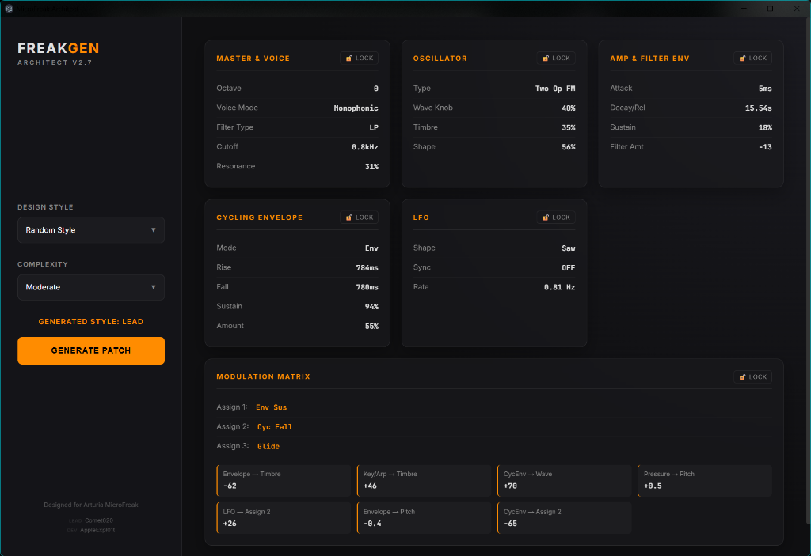

# FreakGEN Architect



**FreakGEN Architect** is a premium, intelligent patch generator designed specifically for the **Arturia MicroFreak** hardware synthesizer. 

Unlike generic randomizers that produce chaotic noise, FreakGEN behaves like a virtual sound designer. It uses "Sound Recipes" to construct musically useful patches (Leads, Pads, Bass, Percussion) while strictly adhering to the physical constraints and modulation architecture of the MicroFreak.

## Features

### 🧠 Intelligent Patch Generation
- **Style-Aware Algorithms**: Select from distinct styles like **Bass, Brass, Keys, Lead, Organ, Pad, Percussion, Sequence, SFX, Strings, and Vocoder**. The engine adjusts envelope shapes, filter types, and oscillator models to match the desired character.
- **Complexity Levels**: Choose between **Simple, Moderate, High, or Extreme** intensity. 
  - *Simple*: Subtle drifts and essential texturing.
  - *Extreme*: Complex, self-evolving modulation storms utilizing up to 20 matrix slot connections.

### 🎛️ Hardware-Accurate Logic
- **Physical Modeling**: The app knows the difference between the "Wavetable" engine (values 1-16) and "BasicWaves" (0-100%). It correctly maps distinct parameters for engines like **Chords** (Major, Minor, etc.) vs. continuous controls.
- **Smart Envelopes**: correctly handles the MicroFreak's switchable envelope modes, generating Time values (milliseconds/seconds) for "Run/Loop" modes and Percentages for standard ADSR behavior.
- **Matrix Intelligence**: Prevents invalid connections (e.g., duplicates) and ensures special parameters like **Unispread** are only modulated when the Voice Mode allows it.

### 🔒 Manual Override (Locking System)
Found the perfect Oscillator sound but hate the LFO? **Lock it.**
FreakGEN allows you to independently lock the **Master, Oscillator, Envelopes, Cycling Env, LFO, and Matrix** sections. When you hit "Generate", locked sections remain untouched while the rest of the patch is reinvented around them.

### 🎚️ Modulation Matrix Architect
- The app simulates the physical modulation matrix, randomly assigning up to 3 "Assignable" user slots (e.g., Glide, Cyc Rise, Resonance).
- It generates specific routing instructions with bipolar amounts (-100 to +100), filtered by "Guardrails" to keep patches musical (e.g., limiting pitch chaos on melodic sounds).

## How to Use
1. **Select a Style** (or choose Random/Chaos).
2. **Select Complexity** (Simple to Extreme).
3. **Click Generate**.
4. **Follow the Recipe**: The UI maps 1:1 to the MicroFreak's physical controls. Simply turn the knobs on your hardware to match the values on the screen.

## Installation / Running
```bash
# Clone the repo
git clone https://github.com/AppleExpl01t/FreakGEN-Architect-.git

# Install dependencies
npm install

# Run the app
npm start
```

## Credits
- **Comet620**: Project Lead & Concept
- **AppleExpl01t**: Lead Developer

---

### TL;DR
A smart randomizer for the Arturia MicroFreak that actually generates good sounds. It respects the synth's hardware limitations, lets you lock specific sections, and outputs precise "recipes" for you to dial in.
